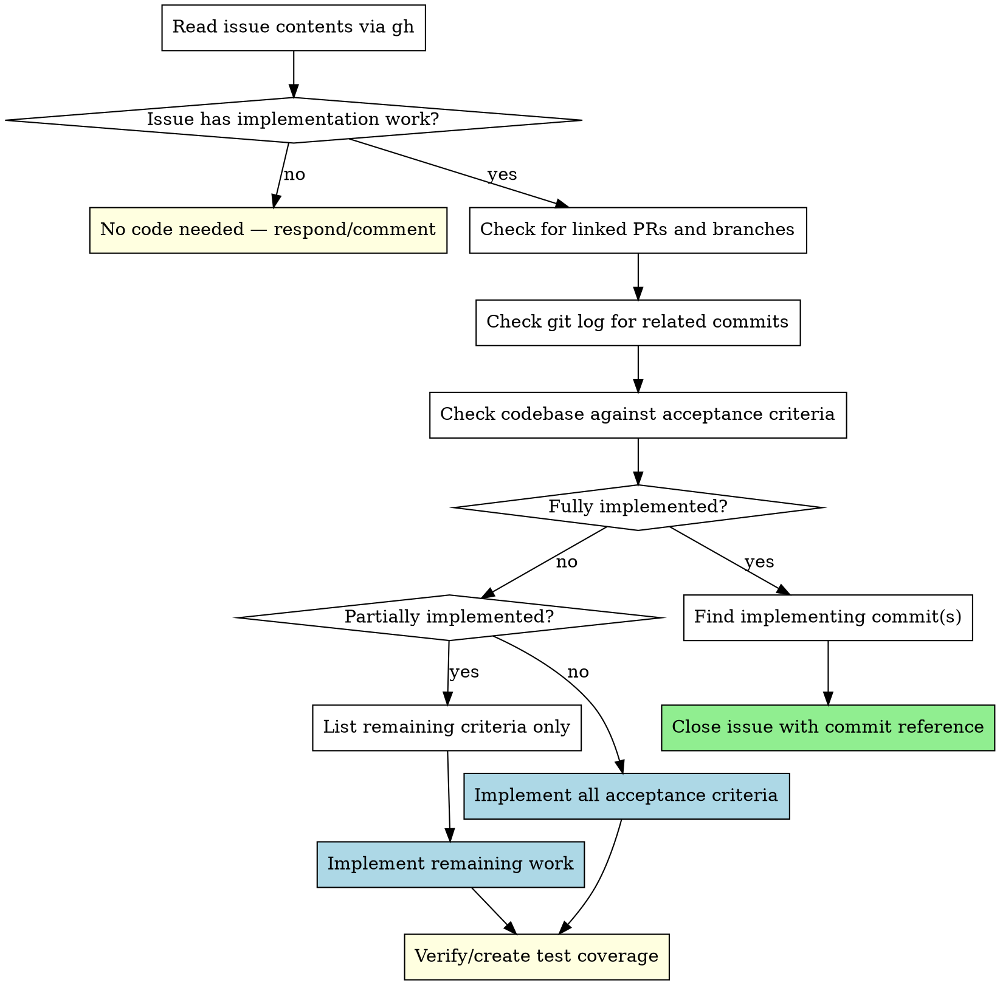

# Complete GitHub Issue

## Overview

Systematically assess a GitHub issue's completion state before implementing anything. Check the issue, git history, PRs, and codebase to determine: fully done, partially done, or not started. Then act accordingly.

**Core principle:** Reconnaissance before implementation. Never implement what's already done.

## When to Use

- Asked to "implement issue #N" or "complete issue #N"
- Given a GitHub issue URL or number to work on
- Asked to "close" or "resolve" an issue
- Working through a backlog of issues

**When NOT to use:**
- Creating a new issue (not implementing one)
- Reviewing a PR (separate workflow)
- Issue is purely a discussion/question (no implementation needed)

## The Process



## Step 1: Read the Issue

```bash
gh issue view <NUMBER>
```

Extract from the issue:
- **Acceptance criteria** (checkboxes, requirements, deliverables)
- **Referenced files** (paths, components, endpoints mentioned)
- **Labels and state** (open/closed, assigned, linked PRs)

If the issue lacks clear acceptance criteria, derive them from the description. List them explicitly before proceeding.

## Step 2: Reconnaissance (BEFORE Any Implementation)

Run these checks — all are required before writing any code:

### 2a. Check for linked PRs

```bash
# Search for PRs that reference this issue
gh pr list --state all --search "<ISSUE_NUMBER>" --limit 10

# Check if any PR body references the issue
gh pr list --state all --search "closes #<NUMBER> OR fixes #<NUMBER> OR resolves #<NUMBER>"
```

If a merged PR exists that addresses the issue, skip to Step 3 (assess completion).

### 2b. Check git history

```bash
# Search commit messages for issue references
git log --all --oneline --grep="#<NUMBER>"

# Search commits touching files mentioned in the issue
git log --all --oneline -- <referenced-files>

# Check for feature branches
git branch -a | grep -i "<keyword>"
```

### 2c. Check codebase against each acceptance criterion

For EACH acceptance criterion, verify whether the code already satisfies it:

```bash
# Search for implementations of specific features mentioned
# Use Grep/Glob to check if components/endpoints/logic exist
```

**Be specific.** Don't just check if a file exists — verify the actual behavior matches the criterion.

## Step 3: Assess Completion State

Score each acceptance criterion:

```
## Completion Assessment

- [x] Criterion 1 — DONE (evidence: <file>:<line>, commit <sha>)
- [ ] Criterion 2 — NOT DONE (missing: <what's missing>)
- [x] Criterion 3 — DONE (evidence: <file>:<line>)
```

**Present this assessment to the user before proceeding.**

### Decision:

| State | All criteria done? | Action |
|-------|-------------------|--------|
| **Fully done** | Yes | Step 4a: Close with reference |
| **Partially done** | Some | Step 4b: Implement remaining only |
| **Not started** | None | Step 4c: Implement all |

## Step 4a: Close with Commit Reference (Fully Done)

Find the implementing commit(s):

```bash
# Find the most relevant commit(s)
git log --all --oneline -- <files-that-changed>

# Get the full commit hash for the primary implementing commit
git log --all --format="%H %s" -- <primary-file> | head -5
```

Then close the issue:

```bash
gh issue close <NUMBER> --comment "Implemented in <commit-sha>.

Acceptance criteria verified:
- [x] Criterion 1 (<file>:<line>)
- [x] Criterion 2 (<file>:<line>)
..."
```

**Before closing**, run Step 5 (Test Verification) to confirm tests exist and pass for the implemented criteria. If tests are missing, create them before closing — an issue isn't truly "done" without test coverage. This applies even when you didn't write the implementation.

**Always include:** the commit SHA, which criteria are satisfied, and where the evidence is.

## Step 4b: Implement Remaining (Partially Done)

1. List ONLY the unmet criteria — do not re-implement done work
2. Implement each remaining criterion
3. After implementation, proceed to Step 5 (Test Verification)

## Step 4c: Implement All (Not Started)

1. Follow normal implementation workflow
2. After implementation, proceed to Step 5 (Test Verification)

## Step 5: Test Verification (Required After Any Implementation)

After implementing code in Step 4b or 4c, tests MUST be checked and updated.

### 5a. Check existing test coverage

```bash
# Find tests related to changed files
# For each file you modified (e.g., MyComponent.tsx), check:
Glob("**/<ComponentName>*.test.*")
Glob("**/<module-name>*.test.*")

# Search for test files that import the changed modules
Grep(pattern: "import.*<changed-module>", glob: "*.test.*")
```

### 5b. Update or create tests

| Situation | Action |
|-----------|--------|
| Tests exist and still pass | Verify coverage of NEW behavior, add test cases if gaps |
| Tests exist but fail | Fix tests to match new behavior (not the other way around) |
| No tests exist for changed code | Create tests covering the acceptance criteria |
| Only unit tests exist for a UI feature | Consider if E2E tests are needed for the workflow |

**What to test:**
- Each acceptance criterion should have at least one test asserting it
- Edge cases mentioned in the issue
- Regression: existing behavior that should NOT have changed

### 5c. Run the full test suite

```bash
# Run unit tests
npm run jest

# Run typecheck
npm run typecheck

# Run E2E tests if UI behavior changed
npm run test:e2e
```

**All tests must pass before claiming completion.** Show output with pass/fail counts.

## Quick Reference

| Check | Command | Why |
|-------|---------|-----|
| Issue details | `gh issue view N` | Understand requirements |
| Linked PRs | `gh pr list --state all --search "N"` | Find existing work |
| Commit history | `git log --all --oneline --grep="#N"` | Find implementing commits |
| File history | `git log --all --oneline -- <files>` | Track changes to relevant files |
| Feature branches | `git branch -a \| grep -i keyword` | Find in-progress work |
| Code check | Grep/Glob for specific implementations | Verify criteria met |

## Common Mistakes

**Jumping straight to implementation**
- You read the issue and start coding without checking if work already exists
- Fix: ALWAYS complete Step 2 reconnaissance before any implementation

**Ignoring closed-but-open state mismatch**
- Issue is closed but you implement anyway, or issue is open but work is already done
- Fix: Issue state is informational, not authoritative. Check the CODE, not just the label.

**Shallow codebase checks**
- Checking if a file exists is not the same as verifying acceptance criteria are met
- Fix: For each criterion, verify the actual behavior, not just file existence

**Re-implementing done work**
- Some criteria are met but you implement everything from scratch
- Fix: Score EACH criterion individually. Only implement what's missing.

**Closing without evidence**
- "This looks done" without specific commit references or file locations
- Fix: Always cite commit SHAs and file:line evidence in close comments

**Skipping test verification**
- Implementing code without checking for existing tests, updating broken tests, or creating missing tests
- Fix: Step 5 is mandatory. Every acceptance criterion needs test coverage.

## Red Flags — STOP

If you catch yourself doing any of these, go back to Step 2:

- Writing code before checking git history
- "I'll just implement it fresh, it's faster"
- Assuming nothing exists because the issue is open
- Assuming everything exists because the issue is closed
- Skipping the completion assessment table
- Implementing without updating or creating tests
- Closing an issue when tests for the implemented criteria don't exist
